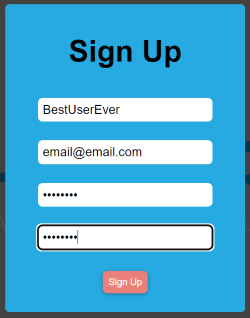
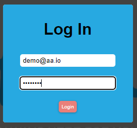
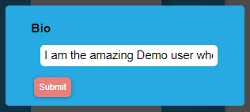
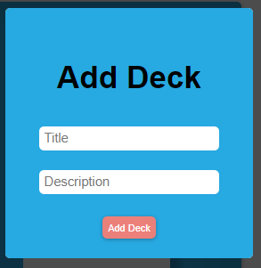
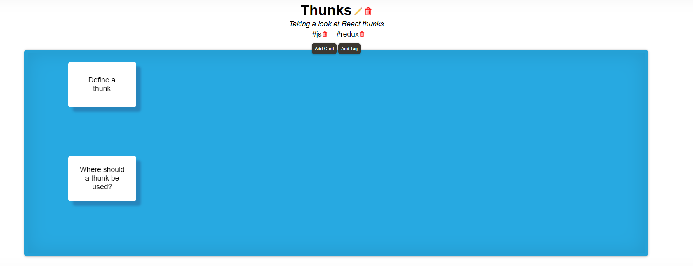
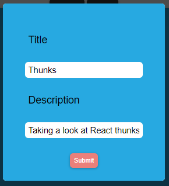
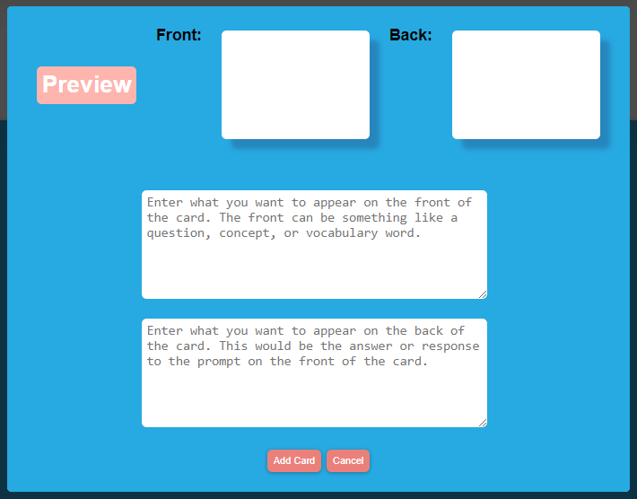
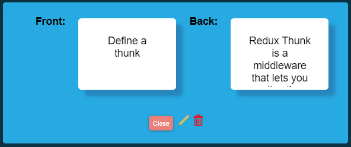
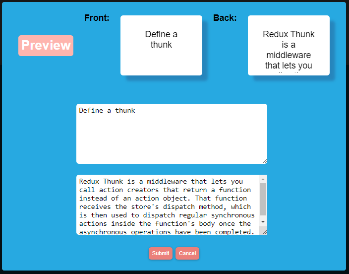

# Study Buddy

<a href="google.com">Live Site</a>  |  <a href="https://github.com/DanielLaV/study_buddy/wiki"> Project Wiki</a> | <a href="https://github.com/DanielLaV/study_buddy/issue">Report Bug</a>

Study Buddy is a website where users can create, study, and share decks of cards for studying computer science topics. This website was designed as a Week 20 project as part of App Academy's 24-week Full Stack Software Engineering Bootcamp.

## Technologies Used
[Javascript](https://developer.mozilla.org/en-US/docs/Web/JavaScript) | [Node.js](https://nodejs.org/en/) | [Flask](https://flask.palletsprojects.com/en/2.0.x/) | [React](https://reactjs.org/) | [Redux](https://redux.js.org/) | [SQLAlchemy](https://www.sqlalchemy.org/) | [PostgreSQL](https://www.postgresql.org/)

## Launching Locally

### Prerequisites
 - [Node.js 16.13.1](https://nodejs.org/en/)

### Getting Started

1. Clone the project repository
```
   git clone https://github.com/DanielLaV/study_buddy.git
```
2. Install dependencies
```
   pipenv install --dev -r dev-requirements.txt && pipenv install -r requirements.txt
```

3.  Create a local .env file modeled after the .env.example file in the root directory
```
   FLASK_APP=app
   FLASK_ENV=development
   SECRET_KEY=<<YOUR-SECRET_KEY>>
   DATABASE_URL=postgresql://study_buddy_dev:<<PASSWORD>>@localhost/study_buddy_db
```
4. Set up your PostgreSQL user, password, and database. Make sure that it matches your .env file!

5. Access your `pipenv shell`, migrate yoru database, seed your database, and run your flask app with the following commands:
```
pipenv shell
```
```
flask db upgrade
```
```
flask seed all
```
```
flask run
```

5. To run the React App, `cd` into the `react-app` directory, install `react-app`, and then start React:
 ```
    cd react-app
 ```
  ```
    npm install
 ```
  ```
    npm start
 ```

## Study Buddy In Action
Full user stories for the initial development phase are available on the [User Stories](https://github.com/DanielLaV/study_buddy/wiki/User-Stories-&-Acceptance-Criteria) section of the project wiki. A feature list for the initial development phase is available on the [Feature List](https://github.com/DanielLaV/study_buddy/wiki/Feature-List) section of the project [wiki](https://github.com/DanielLaV/study_buddy/wiki).

### User Registration and Authentication
New users can register for an account by entering a unique username, email and a secure password.
<p align='center'>

</p>

Existing users can log in to their account by submitting their credentials via the login form.
<p align='center'>

</p>

Logged in users can edit their profile biography
<p align='center'>

</p>

Users may log out of their account by clicking the **LOGOUT** button on the site-wide header.
<p align='center'>

</p>


### Creating and Modifying A Deck

Logged-in users can create a new deck with a title and a description.
<p align='center'>

</p>

All users can view the deck information. Deck owners can only edit or delete their own decks.
<p align='center'>

</p>

When modifying a deck, an Edit form will populate with the deck's current information. Users will be able to edit the deck title and description.
<p align='center'>

</p>


### Creating and Modifying A Card
 A user may add new cards to their deck.
<p align='center'>

</p>

Users can edit or remove cards from their deck.
<p align='center'>

</p>
<p align='center'>

</p>


### Adding and Removing Decks From Their `Study List` Collection

Users can mark any deck as to-be-studied and it will be added to their to-study collection.

Users can remove any deck from their to-study collection.

### Search By Tags

Each deck will have its tags visible. Users can click on the tags to do a search of all decks with that tag.

## < Add images >

With the hundreds of decks to view – how will you remember which ones you want to study? That's where the Study List comes in! Users can dynamically add or remove any deck to their Study List with a click of a button wherever a deck is displayed. They may view their Study List at any time by using the link in the navigation bar or on their home page. The user can click on any deck in their Study List and will be directed to the deck's page to view all of the cards in the deck. The Study List is able to display all of the user's decks on their Study List by making a query in the database for the user's id on the UserStudyDeck model and then joins the Deck model to return all of the matching results.
<p align='center'>

</p>

<p align='center'>

</p>


## Technical Implementation
### Database Design
The full database schema is available to view [on dbdiagram.io](https://dbdiagram.io/d/61f9be7485022f4ee524eb6f), or as a [list of tables on the Database Schema page](https://github.com/DanielLaV/study_buddy/wiki/Database-Schema) of the wiki.


### Frontend Routes
All frontend routes are covered in detail on the [Fronted Routes section of our project wiki](https://github.com/DanielLaV/study_buddy/wiki/Frontend-Routes). Frontend routes were designed to enable users access to basic functionality such as registration, authentication, viewing decks, accessing cards, searching by tags, and viewing their profile page where users can manage their decks.

### API Routes
All frontend routes are covered in detail on the [API Routes section of our project wiki](https://github.com/DanielLaV/study_buddy/wiki/API-Documentation). API routes were designed for users to interact with a page without being redirected.
   </br>

## Developmental Challenges

### Search Function

The search function searches for a query in the following resources and their columns:  `deck title`, `deck description`, `card front`, `card back`. The search route needs to query the database for those four columns, return the data in a way that's easily accessible by the frontend, and, when there are no matches, return an indication that no entries in the database match the search query. Thus, the business logic for the search function requires `try ... except` blocks, concatenate matches from the `Deck` resource with each other, concatenate matches from the `Card` resource with each other, check if either of those resources exist, check for the existence of results from either resource, and return an appropriate response from the backend. The reponse from the backend should not cause issues with the `searchReducer` on the frontend if there are search results in one resource but not the other.

```py
@search_routes.route('/<string:query>', methods=['GET'])
def main(query):
    """
    'GET' searches the Card and Deck database .
    The function returns all tags associated with that deck.
    """
    if 16 < len(query) < 2:
         return {"errors": "Query must be between 2 and 16 characters long"}, 401
    else:
        # deck results: querying title and description
        try:
            deck_title_results = Deck.query.filter(Deck.title.ilike(f"%{query}%")).all()
            deck_title_results = [deck.to_dict() for deck in deck_title_results]
        except:
            pass
        try:
            deck_desc_results = Deck.query.filter(Deck.description.ilike(f"%{query}%")).all()
            deck_desc_results = [deck.to_dict() for deck in deck_desc_results]
        except:
            pass
        # card results: querying front and back
        try:
            card_front_results = Card.query.filter(Card.front.ilike(f"%{query}%")).all()
            card_front_results = [card.to_dict() for card in card_front_results]
        except:
            pass
        try:
            card_back_results = Card.query.filter(Card.back.ilike(f"%{query}%")).all()
            card_back_results = [card.to_dict() for card in card_back_results]
        except:
            pass
        all_deck_results = deck_title_results + deck_desc_results
        all_card_results = card_front_results + card_back_results
        if (all_deck_results or all_card_results):
            return {"decks": all_deck_results, "cards": all_card_results}, 200
        else:
            return {"errors": ["No results found!"]}, 401
```

The frontend then needs to parse the data incoming from the backend. If there are results from either resource, it needs to update the store appropriately:
````JS
export const getResults = (query) => async (dispatch) => {
    const response = await fetch(`/api/search/${query}`, {
        headers: { "Content-Type": "application/json" }
    });
    const results = await response.json();
    console.log("results", results)
    if (response.ok) {
        dispatch(load(results))
    }
    return results
}

const searchReducer = (state = {}, action) => {
    switch (action.type) {
        case LOAD: {
            const decks = {}
            action.results.decks.forEach((deck) => {
                decks[deck.id] = deck
            })
            const cards = {}
            action.results.cards.forEach((card) => {
                cards[card.id] = card
            })
            return {decks, cards}
        }
        default: return state;
    }
}
````

If there aren't any results, it needs to receive and display the message from the backend that no results were found.
```js
if (query) {
   return dispatch(getResults(query.toLowerCase())).then(
      (response) => {
         if (response.errors) {
            setHasResults(false)
            setErrors(response.errors)
            return
         }});
}
```

### OTHER CHALLENGE


### Improved User Experience

#### **Site-wide Responsiveness**

The website is currently functional on all screen sizes, but is styled for screens greater than 900 px in width. New smaller-scale layouts will be implemented so that the user experience on mobile or tablet devices is comparable to the desktop user experience.

### Improved Maintainability

#### **Normalization of Tag Names**

Currently, all tags are stored as rows on a database. If a user types in a new tag for a deck that is not already in the database, a new tag is created. However, the addition of new tags does not currently account for spelling or capitalization variations. For example, JavaScript, Javascript, and JS would all be stored in the database as separate tags. In order to support future functionality, tag names may undergo a pattern-matching normalization process or third-party name API validation to prevent duplicate entries within our database.

## Contributors
**Sophia Bui** | <a href='https://github.com/sophiebui'>Github</a> | <a href='https://www.linkedin.com/in/sophia-bui/'>LinkedIn</a></br>
**Kreston Caldwell-McMurrin** | <a href='https://github.com/krestn'>Github</a> | <a href='https://www.linkedin.com/in/krestoncaldwell/'>LinkedIn</a></br>
**Daniel LaVergne** | <a href='https://github.com/DanielLaV'>Github</a> | <a href='https://www.linkedin.com/in/daniel-lavergne-137772206/'>LinkedIn</a></br>
**Denise Li** | <a href='https://github.com/cat-friend'>Github</a> | <a href='https://www.linkedin.com/in/denise-li-45350320/'>LinkedIn</a>
